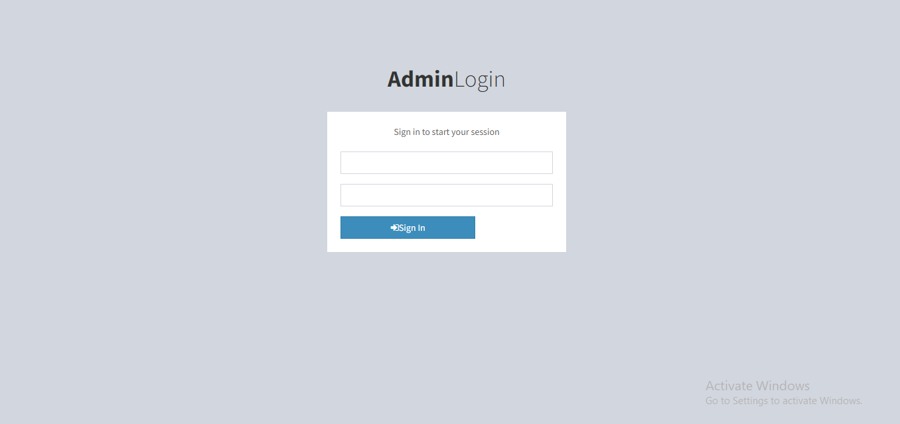

# Laravel Separate Admin Auth in Laravel 8
This is an example of a creating separate admin panel using auth with Laravel

After clone you can run it

### how to achieve follow a few steps 
Getting Started
1. Clone the repository and install composer packages by running:
```bash
composer update 
```
2. Create .env file from env.example
```bash
copy .env.example .env
```
4. Generate Application Key for your application.
```bash
php artisan key:generate
```
5. Run migration for create users table, admins  tables :
```bash
php artisan migrate --seed
```
6. Run your Laravel application
```bash
    php artisan serve
```
7. Go to http://127.0.0.1:8000/admin/login , login as <EMAIL> password:<PASSWORD>.
 </img>

8. You will see dashboard page after successful authentication
9. Now go to http://127.0.0.1:8000/admin/dashboard , this route only accessible if user loggedin
